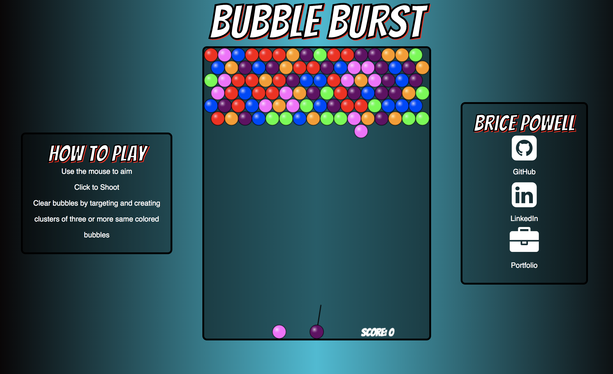

# BubbleBurst

### [LIVE](http://bubbleburst.bricepowell.com)


BubbleBurst is a survival-style bubble shooter game, similar to Bust-a-Move. Players shoot bubbles, with the goal of clearing the board by clustering the bubbles together. Clusters of three or more "burst" and the adventure continues.

## Instructions

* Use the mouse to aim
* Click to shoot
* Create clusters of three or more same colored bubbles to clear them from the board and score points
* The game is over if the bubbles reach the bottom of the board.

## Technologies

* JavaScript
* Canvas


## Features and Implementation

All features of this game were implemented using vanilla JavaScript DOM manipulation. Drawing was done using HTML5 canvas.

### Calculating shot angle via cursor location


onMouseMove is triggered every time the cursor is moved around on the canvas. I takes advantage of the basics of trigonometry in order to calculate the angle between the bubble shooter and the cursor. This angle is later used to correctly bounce bubbles off of the walls.

```javascript
onMouseMove(e) {
    let pos = this.getMousePos(e);
    let mouseangle = this.radToDeg(Math.atan2((this.canvas.height - 15) - pos.y, pos.x - ((this.canvas.width/2))));

    if (mouseangle < 0) {
        mouseangle = 180 + (180 + mouseangle);
    }
    const lbound = 8;
    const ubound = 172;
    if (mouseangle > 90 && mouseangle < 270) {
        if (mouseangle > ubound) {
            mouseangle = ubound;
        }
    } else {
        if (mouseangle < lbound || mouseangle >= 270) {
            mouseangle = lbound;
        }
    }

    this.angle = mouseangle;
    this.shooter.loadedBubbles[0].angle = mouseangle;
  }
}
```


### Finding bubble clusters and floaters
Bubble burst uses a technique similar to Breadth First Search to find clusters of bubbles and remove them from the board. By implementing a First in First out approach, each bubble is asked for its neighbors, which are filtered to be the same color by 'this.findNeighbors'. The current bubble is then pushed into an array of 'seen' bubbles to ensure it does not end up back in the queue, while all of its neighbors are pushed intot he queue so that their neighbors can then be looked at.


```javascript
findCluster(bubble){
  let queue = [bubble];
  let cluster = [];
  let seen = [];
  while (queue.length > 0) {
    let bubb = queue.shift();
    cluster.push(bubb);
    seen.push(bubb);
    let neighbors = this.findNeighbors(bubb);
    neighbors.forEach((neighbor)=>{
      if (
        seen.includes(neighbor) === false
         ) {
           queue.push(neighbor);
         }
         seen.push(neighbor);
    });
  }
  return cluster;
}
```

## Future Features

* Explicit bubble popping animation
* Difficulty settings
* High scores

## To Run Locally

* Clone this repo
* Copy the full path of index.html and paste into your browser
* Alternatively open your terminal, navigate to the BubbleBurst root folder and type 'open index.html'
