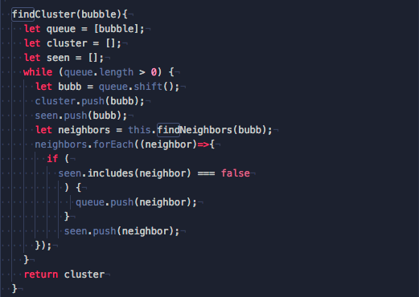

# BubbleBurst

### [LIVE](https://www.bubbleburst.bricepowell.com)

BubbleBurst is a survival-style bubble shooter game, similar to Bust-a-Move. Players shoot bubbles, with the goal of clearing the board by clustering the bubbles together. Clusters of three or more "burst" and the adventure continues.

## Instructions

* Use the mouse to aim
* Click to shoot
* Create clusters of three or more same colored bubbles to clear them from the board and score points
* The game is over if the bubbles reach the bottom of the board.

## Technologies

* JavaScript
* Canvas

## Features and Implementation

All features of this game were implemented using vanilla JavaScript DOM manipulation. Drawing was done using HTML5 canvas.

## BFS Bubble Cluster

A breadth first search algorithm was implemented in order to find clusters of same color bubbles upon collision. As well as to find bubbles which are left "floating" after clusters have been removed.

## Future Features

* Explicit bubble popping animation
* Difficulty settings
* High scores

## To Run Locally

* Clone this repo
* Copy the full path of index.html and paste into your browser
* Alternatively open your terminal, navigate to the BubbleBurst root folder and type 'open index.html'
